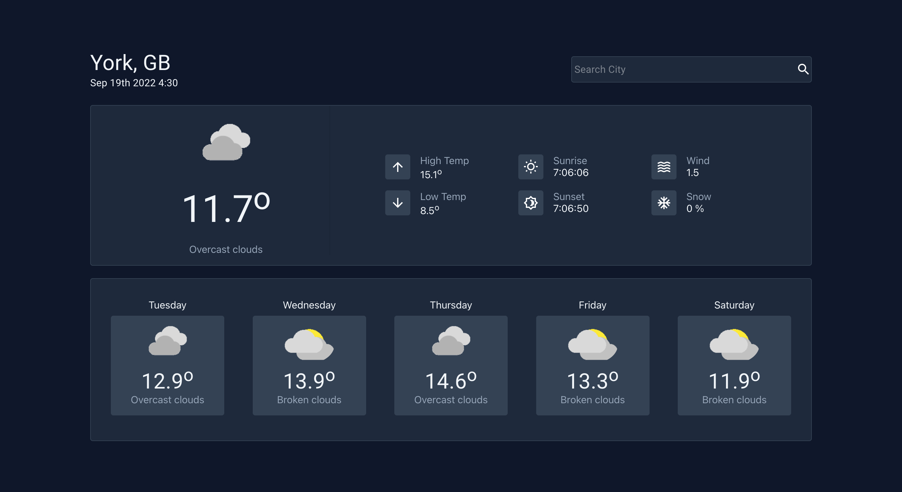
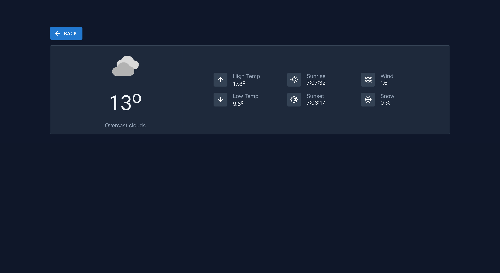

# Getting Started with Weather Forecast APP

This project was bootstrapped with [Create React App](https://github.com/facebook/create-react-app).

## Installed Libraries
`React` `Redux Toolkit` `React-routers` `Moment` `Axios` `Material UI`

## IDE Used
### `WebStorm 2022.2.2`

## Installation
### `npm start`
Application will run in the development mode.
Runs the app in the development mode.\
Open [http://localhost:3000](http://localhost:3000) to view it in your browser.

The page will reload when you make changes.\
You may also see any lint errors in the console.

## Folders Structure
weatherforecast/

 - publlic
 - src/ 
   - Components
     - Common
       - Api Request
       - Not Found page
     - Home
       - Skeleton Loading
       - Modals Compoment
       - Actions
       - Reducer
       - Home Page
     - Store
     - Styles

## Dicussions 
I have called the homepage.js component, which renders the home page, in App.js. 
I divided the home page into various sections, much like the modal components, where each component was organised 
separately and given the right name.

I've created a skeleton component for the API fetching case and called it from within the home page while on loading request.

You may find the current weather component there, where I have the current day's forecast coded. Same for Five days forecast
I have kept in FiveDayForecast component.
If you click on the day forecast, it will redirect you to another route. For that, I have rendered the ForecastSelected component.

I have kept the action and reducer files inside the home page dir, as this was a small task, but for big projects it's a bit harder to
find the actions and reducers. If we have more pages, it's going to be simple and easy for others to find the relevant files.

## How to use the app
The first element, I have shown the city name and date, was extracted from the API response.
I also implemented a search bar, which will fetch data by city. (e.g. London, York, Coventry).
By default, I have called the provided URL from the task document.

Below the city/search bar I have shown the current day's forecast.

Below this section I have displayed the five day forecast card, which is clickable. and it will show the specific day's selected data.

## UI/UX Figma
As this was a small task, I quickly draw some paper for idea and designed the High fiedelty prototype. And tested the prototype with only
one user. 
[Click here for Figma Prototype](https://www.figma.com/file/kGOhNV6kpgnK4mjD7CfNO3/Weather-forecast?node-id=0%3A1).

If you face any problem while installing and running the app, feel free to ask me.

## Screenshots

